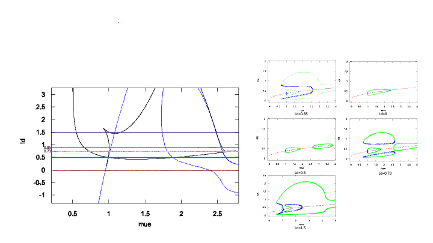
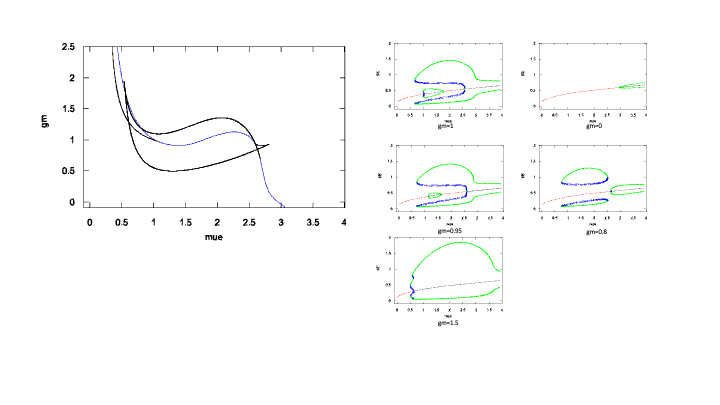
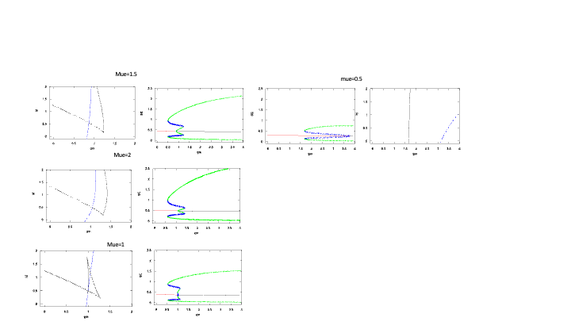
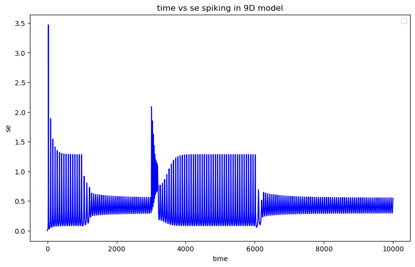

<head>
    <meta charset="UTF-8">
    <meta name="viewport" content="width=device-width, initial-scale=1.0">
    <title>Project Summary</title>
    
    
</head>

<body>
<h1>Bistability analysis of excitatory, inhibitory and somatostatin neuron network</h1>

<!-- Table of Contents -->
<h2>Table of Contents</h2>
<ul>
  <li><a href="#Introduction">Introduction</a></li>
  <li><a href="#Integrate-and-fire-model">Integrate and fire model</a></li>
  <li><a href="#Quadratic-Integrate-and-fire-model">Quadratic Integrate and fire model model</a></li>
  <li><a href="#Theta-model">Theta model</a></li>
  <li><a href="#Network">Network</a></li>
  <li><a href="#Population-model-to-9D-model">Population model to 9D model</a></li>
  <li><a href="#Mathematical-Analysis-for-Bifurcation">Mathematical Analysis for Bifurcation</a></li>
  <li><a href="#Simulation">Simulation</a></li>
  <li><a href="#References">References</a></li>

</ul>

<!-- Sections -->
<!-- Introduction Section -->
<h2 id="Introduction">Introduction</h2>

Recently we have seen a lot of studies of E + I neuron networks, spiking models,
   γ oscillatory neurons, etc. Recent studies indicate the importance of the other populations 
   of inhibitory interneurons. The E + I network is specifically Pyramidal cells (E) and Parvalbumin(I) cells,
    notably, somatostatin neurons(I). They have different temporal properties and different connectivities. 
    The goal of this paper is to explore the dynamics when there are 3 populations of cells.

<!-- IF Section -->
<h2 id="Integrate-and-fire-model">Integrate and fire model</h2>

The Integrate-and-Fire neuron is a simplified computational model that simulates the membrane potential 
  of a neuron, integrating incoming electrical signals until a threshold is reached, at which point it "fires" 
  (generates an action potential) and then resets its membrane potential. This model captures the basic behavior
   of neuronal spiking in response to synaptic inputs.
   The right hand side RC circuit model 
  $$\tau \frac{dy}{dx}=-(u-u_{rest})+RI$$

  

  <!-- QIF Section -->
<h2 id="Quadratic-Integrate-and-fire-model">Quadratic Integrate and fire model</h2>

In an EF model  
                        $$\tau \frac{𝑑𝑢}{𝑑𝑡}=𝐹(𝑢)$$
If we have $F(u)$ a quadratic equation then the model will be called Quadratic Integrate and fire neuron; QIF. 

In the RHS video I have used 
 $$𝐹(𝑢)=𝑢^2−𝑎^2+𝐼. $$
The input current is 30 and 50 at time 50 and 300.

<video controls>
        <source src="videos/qif_neuron_simulation.mp4" type="video/mp4">
        Your browser does not support the video tag.
    </video>

  <!-- Theta Section -->
<h2 id="Theta-model">Theta model</h2>

If we put \(𝑢=\tan⁡\frac{𝜃}{2}\) then our equation $$\tau \frac{𝑑𝑢}{𝑑𝑡}=𝑢^2−𝑎^2+𝐼$$ will become
$$\tau \frac{𝑑\theta}{𝑑𝑡}=(1−\sin⁡\theta)−𝑎^2 (\cos⁡\theta+1)+𝐼(\cos⁡\theta+1)$$
This is a Theta model.

  <!-- Network Section -->
<h2 id="Network">Mathematical Analysis</h2>

<!-- Network Section -->
<h2 id="Population-model-to-9D-model">Population model to 9D model</h2>
<h3>How do we relate population to spiking model</h3>

So the first step is to consider a large population of \(N\) globally coupled quadratic integrate and fire neurons (QIF):
$$
\tau_m \frac{d V_j}{d t}=V_j^2+\mu(t)+\Delta \xi_j+g S
$$
where \(\mu(t)\) is global (to every neuron) drive, \(\Delta\) is a heterogeneity strength, \(\xi_j\) is taken from some symmetric distribution centered at \(0, q(\xi)\), but fixed in time, and \(S\) satisfies:
$$
\tau_s \frac{d S}{d t}=-S+\frac{1}{N} \sum_{j=1}^N \sum_k \delta\left(t-t_j^k\right)\tau_m .
$$
    
The times \(t_j^k\) satisfy

$$
\lim _{t \rightarrow t_j^k} V_j(t)=+\infty
$$
and are the times that neuron \(j\) fires a spike and \(V_j\) is set to \(-\infty\). So every neuron is connected to every other one through the synaptic drive, gS. Let \(P(V, \xi, t)\) denote the probability density for the voltages. That is \(P(V, \xi, t)\) is the probability of a randomly chosen neuron having a voltage \(v\) and hetereogeneity, \(\xi\) at time \(t\). Let \(f(V, \xi, t)=V^2+\mu(t)+\Delta \xi+g S\). Then, the probability density evolves as:
\begin{equation}
   (1) \tau_m \frac{\partial P(V, \xi, t)}{\partial t}+\frac{\partial}{\partial V}(f(V, \xi, t) P(V, \xi, t))=0
\end{equation}

The flux \(J(V, \xi, t) =\frac{f(V, \xi, t) P(V, \xi, t)}{\tau_m}\) is the rate at which a neuron crosses \(V\). The firing rate of a neuron with parameter \(\xi\) at time \(t\) is
$$
R(\xi, t)=\lim _{V \rightarrow \infty} J(V, \xi, t)
$$
and the mean firing rate is
$$
r(t)=\int_{-\infty}^{\infty} q(\xi) R(\xi, t) d \xi .
$$
where $$q(\xi)=\frac{1}{\pi}\frac{1}{1+\xi^2}$$

We make the ansatz that
$$
P(V, \xi, t)=\frac{1}{\pi} \frac{\alpha(\xi, t)}{(V-\beta(\xi, t))^2+\alpha(\xi, t)^2}
$$

this function satisfies Eq. (1) if and only:
$$
\begin{aligned}
& \tau_m \frac{\partial \alpha}{\partial t}=2 \alpha \beta \\
& \tau_m \frac{\partial \beta}{\partial t}=\beta^2-\alpha^2+\mu+\Delta \xi+g S .
\end{aligned}
$$
With this ansatz, we see that
$$
r(t)=\frac{1}{\pi} \int_{-\infty}^{\infty} q(\xi) \alpha(\xi, t) d \xi .
$$
So that we have an infinite set of differential equations (one for each value of $\xi$ all coupled via \(r(t)\) as:
$$
\tau_s \frac{d S}{d t}=-S+r(t) .
$$

Let \(w(\xi, t)=\beta(\xi, t)+i \alpha(\xi, t)\) so that
$$
\tau_m \frac{\partial w}{\partial t}=w^2+\mu+\Delta \xi+g S .
$$
To close this system we need to evaluate the integral that defines \(r(t)\). 
Using the Cauchy Residue theorem we get that

$$
r(t)=\frac{1}{\pi} \alpha(i, t)
$$
so that all that wee need to do is study our system at a single value of \(\xi=i\). Let \(w(i, t)=b(t)+i a(t)\) and derive
$$
\begin{aligned}
\tau_m a_t & =2 a b+\Delta, \\
\tau_m b_t & =b^2-a^2+\mu+g S \\
\tau_s S_t & =-S+\frac{a}{\pi}
\end{aligned}
$$

Hence we get two equivalent model from QIF 
$$
\tau_m \frac{d V_j}{d t}=V_j^2+\mu(t)+\Delta \xi_j+g S
$$ 

to 

$$
\begin{aligned}
\tau_m a_t & =2 a b+\Delta, \\
\tau_m b_t & =b^2-a^2+\mu+g S \\
\tau_s S_t & =-S+\frac{a}{\pi}
\end{aligned}
$$

Then we used our theta transformation for spiking neurons and simulated our model with it.

<h2 id="Mathematical-Analysis-for-Bifurcation">Mathematical Analysis for Bifurcation</h2>
Note that \(\Delta \geq 0\), but \(\mu, g\) can be any sign and \(\tau_{m, s}>0\). Now you are all set to do the following three things.

 Suppose that \(\tau_m \ll \tau_s\) and prove that there can be no limit cycles by letting \(\tau_m=0\) and solving for \(a\) and plugging into the equation for \(S\).

 Suppose \(\tau_s \ll \tau_m\) so that you can set \(S=a / \pi\). Plug this into the \((a, b)\) system and show there is no Hopf bifurcation (HB) possible. That is considering:
$$
\begin{aligned}
& \tau_m a_t=2 a b+\Delta, \\
& \tau_m b_t=b^2-a^2+\mu+g a / \pi .
\end{aligned}
$$

Then there is no HB, i.e., there is actually no limit cycle.

Let \((\bar{a}, \bar{b}, \widehat{S})\) be a fixed point and suppose \(g<0\). Find conditions for which there is the possibility of a HB for the full 3D system and compute the bifurcation diagram numerically. You will need to use the Routh-Hurwitz (RH) criteria. Specifically, given a characteristic polynomial:
$$
\lambda^3+c_2 \lambda^2+c_1 \lambda+c_0=0
$$
$\mathrm{RH}$ says that there are imaginary eigenvalues if and only if \(c_2, c_0>0\) and \(c_1 c_2=c_0\).

<h2 id="Simulation">Simulation</h2>

Now we are trying simulate what we did mathematically. Hence getting our simpler 9D model that we get 
$$
\begin{aligned}
\tau_m a_t & =2 a b+\Delta, \\
\tau_m b_t & =b^2-a^2+\mu+g S \\
\tau_s S_t & =-S+\frac{a}{\pi}
\end{aligned}
$$
for excitatory, inhibitory and somatostatin we simulated them over XPPAut

<pre><code>    
    ae'=(2*ae*be+dele)/tme
    be'=(be^2-ae^2+gee*se-gie*si-ld*gse*ss+mue)/tme
    se'=(-se+ae/pi)/taue
   
    ai'=(2*ai*bi+deli)/tmi
    bi'=(bi^2-ai^2+gei*se-gii*si-ld*gsi*ss+mui)/tmi
    si'=(-si+ai/pi)/taui
    
    as'=(2*as*bs+dels)/tms
    bs'=(bs^2-as^2+ges*se-gis*si-gss*ss+mus)/tms
    ss'=(-ss+as/pi)/taus
    
    #for bifurcation gsi=.5 and mue=0
    Param mue=0,ld=0.85
    par taus=15
    par gee=1.5,gei=2,ges=4.25 
    par gie=1,gii=.5,gis=0
    par gse=2,gsi=0.5,gss=0
    par tme=20,tmi=10,tms=10
    par taue=2,taui=7.5
    Par mui=-.5,mus=-2
    par dele=.1,deli=.1,dels=.1
    
    #Auto
    @ ntst=60, npr=500, nmax=2000, autoxmin=-0.1, autoymin=-0.1
    @ autoxmax=4, autoymax=2, ds=.05, dsmin=0.001, dsmax=0.05, parmin=0, parmax=3.9
    
    @ total=4000,meth=cvode,tol=1e-10,atol=1e-10,bound=10000
    d 
</code></pre>

The mathematical version of our model is given by,

\begin{align*} 
s_e'&=\frac{1}{\tau_e}\left(-s_e+\frac{a_e}{\pi}\right)\\
a_e'&=\frac{1}{\tau_{me}}(2a_eb_e+\delta_e)\\
b_e'&=\frac{1}{\tau_{me}}(b_e^2-a_e^2+g_{ee}s_e-g_{ie}s_i-\lambda g_{se}ss+\mu_e)\\
s_i'&=\frac{1}{\tau_i}\left(-s_i+\frac{a_i}{\pi}\right)\\
a_i'&=\frac{1}{\tau_{mi}}(2a_ib_i+\delta_i)\\
b_i'&=\frac{1}{\tau_{mi}}(b_i^2-a_i^2+g_{ei}s_e-g_{ii}s_i-\lambda g_{si}ss+\mu_i)\\
s_s'&=\frac{1}{\tau_s}\left(-s_s+\frac{a_s}{\pi}\right)\\
a_s'&=\frac{1}{\tau_{ms}}(2a_sb_s+\delta_s)\\
b_s'&=\frac{1}{\tau_{ms}}(b_s^2-a_s^2+g_{es}s_e-g_{is}s_i- g_{ss}ss+\mu_s).
\end{align*}

Here \(s'=\frac{ds}{dt}.\)

The values are given for the bifurcation diagram,
<ul>
    <li>\(\tau_{e}\): Time constant for the excitatory state\(=2\)</li>
    <li>\(\tau_i\): Time constant for the inhibitory state\(=7.5\)}</li>
    <li>\(\tau_s\): Time constant for this component's state\(=15\)</li>
    <li>\(\tau_{me}\): Time constant related to amplitude variables\(=20\)</li>
    <li>\(\tau_{mi}\): Time constant related to amplitude variables\(=10\)</li>
    <li>\(\tau_{ms}\): Time constant related to amplitude variables\(=10\)</li>
    <li>\(g_{ee}\): Interaction strengths or connectivity coefficients between excitatory neurons\(=2\)</li>
    <li>\(g_{ie}\): Interaction strengths or coupling parameter from i to e\(=1\)</li>
    <li>\(g_{se}\): Interaction strengths or coupling parameter from s to e\(=2\)</li>
    <li>\(g_{ei}\): Interaction strengths or coupling parameter from e to i\(=2\)</li>
    <li>\(g_{ii}\): Interaction strengths or connectivity coefficients between inhibitory neurons\(=0.5\)</li>
    <li>\(g_{si}\): Interaction strengths or coupling parameter from s to i\(=0.5\)</li>
    <li>\(g_{es}\): Interaction strengths or coupling parameter from e to s\(=4.25\)</li>
    <li>\(g_{is}\): Interaction strengths or coupling parameter from i to s\(=0\)</li>
    <li>\(g_{ss}\): Interaction strengths or connectivity coefficients between somatostatin neurons\(=0\)</li>
    <li>\(\mu_{e}\): External input to the excitatory population\(=0\)</li>
    <li>\(\mu_{i}\): External input to the inhibitory population\(=-0.5\)</li>
    <li>\(\mu_{s}\): External input to this component\(=-2\)</li>
    <li>\(\delta_{e}\): An external input or driving force affecting the excitatory population \(a_e=0.1\)</li>
    <li>\(\delta_{i}\): An external input or driving force affecting the inhibitory population \(a_i=0.1\)</li>
    <li>\(\delta_{s}\): An external input or driving force affecting the inhibitory population \(a_s=0.1\)</li>
    <li>\(\lambda\): Parameter that influence synaptic activity\(=0.85\)</li>
</ul>
  

  <figcaption>Two parameters and the corresponding one-parameter bifurcation diagram. We have done all our simulations with \(ld=\lambda=0.85\). Initially, we were trying to track the 2par vs 1par diagram when the left-hand side is two-parameter diagrams and we have drawn the line corresponding to \(\lambda=0.85,0,0.5,0.73,1.5\) and then on the right-hand hand the corresponding one-parameter bifurcation diagrams. In a two-parameter diagram the black curves correspond to the fold limit cycle and the blues are Hopf bifurcation points. In a one-parameter diagram, the reds correspond to the stable equilibrium point and the blacks correspond to the unstable equilibrium point, the blues are unstable limit cycles and the greens are stable limit cycles. We have also given the numbering for lambda=0.27,1,1.5 so that we can see hold and Hopf bifurcation side by side. For example, for lambda=1.5 we can match the numbers 1(fold limit cycle),2(fold limit cycle),3(fold limit cycle),4(Hopf bifurcation),5(fold limit cycle),6(Hopf bifurcation),7(Hopf bifurcation),8(fold limit cycle),9(fold limit cycle) matched in colors.</figcaption>

Similarly we have introduced \(\gamma\) to control inhibition to excitation and inhibition to inhibition and simulated \(\mu_{e}\) vs \(\gamma\) and \(\lambda\) vs \(\gamma\)
<table>
  <tr>
    <td>
      
    </td>
    <td>
      
    </td>
  </tr>
</table>

    Now we have simulated the neurons with proper parameters and we get
    

  <figcaption>Oscillation changes with external current. As we have seen in the bifurcation diagram that we need to choose \(g_{ee}=2\) and \(\mu_e=1.25\)(as we wanted to start with the bigger limit cycle if we want to start with the smaller limit cycle we should go with \(\mu_e=1.8\)) then we set the other parameters as \(g_{ei}=2, g_{es}=4.25, g_{ie}=1,g_{ii}=.5,g_{is}=0, g_{se}=2,g_{si}=0.5,g_{ss}=0, \tau_{me}=20,\tau_{mi}=10,\tau_{ms}=10, \tau_e=2,\tau_i=7.5,\tau_s=15,\)
\(\mu_i=-.5,\mu_s=-2, \delta_e=0.1,\delta_i=0.1,\delta_s=0.1\) Hence, we started in the bigger limit cycle. Next, we injected inhibition ampi=3 at t=1000 to go to the lower limit cycle then we injected inhibition ampe=6 at t=3000 to go to the bigger limit cycle and lastly, we injected inhibition amps=4 at t=6000 to go to the lower limit cycle again. Here the duration of the impulse is wid=200.</figcaption>

<h2 id="References">References</h2>
<ol>
  <li> <a href="[Theta model](https://en.wikipedia.org/wiki/Theta_model)"> [wiki](Theta model)</a></li>
  <li>Second item in the list</li>
  <li>Third item in the list</li>
</ol>

   
    

